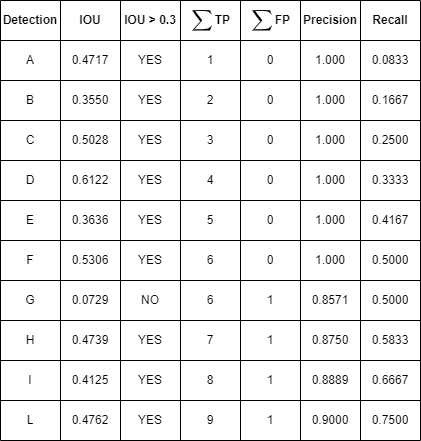
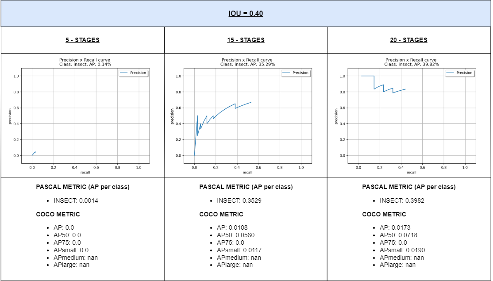

# Viola Jones algorithm for object detection in Smart Agriculture applications

## <ins>Goals</ins>:
+ Use of frameworks and libraries for video and image analysis
+ Design of a classification algorithm for the detection of insects through the use of OpenCV libraries
***

## <ins>Requirements</ins>:
+ Ubuntu 20.04 LTS running on WSL 2
+ OpenCV 3.14.14
***

## <ins>Theory</ins>:
**References**:
+ https://towardsdatascience.com/viola-jones-algorithm-and-haar-cascade-classifier-ee3bfb19f7d8
+ https://docs.opencv.org/3.4/db/d28/tutorial_cascade_classifier.html
+ https://johnallen.github.io/opencv-object-detection-tutorial/
+ https://pythonprogramming.net/haar-cascade-object-detection-python-opencv-tutorial/ (for negative samples)


***

## <ins>Cascade classifier training</ins>:

In this phase, several OpenCV applications were used, including: [opencv_createsamples](https://github.com/opencv/opencv/tree/3.4/apps/createsamples), [opencv_annotation](https://github.com/opencv/opencv/tree/3.4/apps/annotation), [opencv_traincascade](https://github.com/opencv/opencv/tree/3.4/apps/traincascade).


> **_Note:_** <ins>opencv_createsamples</ins> and <ins>opencv_traincascade</ins> are disabled by OpenCV 4.0. An OpenCV version higher than 3.14 may create conflicts.

### **Data preparation**
To train the classifier we need many samples, which results in many images showing the object we want to detect, in our case insects, and many other images that do not contain the object in question. Training a good cascade classifier requires a large number of samples both positive and negative.

In the workspace **[model_training](./model_training/)** there are folders for:
1. **data** (for the trained cascade)
2. **neg** (for images that do not contain objects of interest)
3. **pos** (for images containing objects of interest)
4. **src** (for pyhton modules)
5. **val** (for validation images)

#### **Negative samples**
Negative samples are images that must not contain insects. Images can be of different sizes, but in our case we used grayscale JPG images of size 100px * 100px in order to reduce processing time. They were taken from this **[site](https://pythonprogramming.net/haar-cascade-object-detection-python-opencv-tutorial/)**, and are available for download directly from **[here](https://pythonprogramming.net/static/images/opencv/negative-background-images.zip)**. Each image in the **neg** folder should be equal or larger than the training window, which was in our case 20px * 20px because each negative image will be used to generate several samples of the same size as the training window. In addition, all these images must be listed in a file containing one image path per line.

In the model_training folder there is a file called **bg.txt** with structure:

```
neg/img1.jpg
neg/img2.jpg
neg/img3.jpg
neg/img4.jpg
neg/img5.jpg
...
```

To make it easier to write the file, which is a rather tedious task, a small Python script called **[negative.py](./negative.py)** has been written to generate the bg.txt file by itself and place it inside the model_training folder. For using it:

```bash
user@user:~$ python3 negative.py 2000  # The input argument depends on the number of negative images
```


#### **Positive samples**
As concerns positive samples, OpenCV provides the <ins>opencv_createsamples</ins> application that generates a series of positives by applying transformations and rotations to a single input image. While this is the fastest option to go and generate the positives, it is also the one that provides the poorest results. This method is best suited for detecting fixed objects, but tends to fail easily with less rigid objects. 

OpenCV also provides the <ins>opencv_annotation</ins> application. This tool generates the dataset of positive images by marking a series of images containing the object to be detected.

In this project, the second method was chosen. The annotation tool reviews all the images contained in the **pos** folder and listed in the previously written **info.txt** file and with structure:

```
pos/img1.jpg
pos/img2.jpg
pos/img3.jpg
...
```

Again, to launch **[positive.py](./positive.py)**, you can use the following command:

```bash
user@user:~$ python3 positive.py 150  # The input argument depends on the number of positive images
```

***

To use the annotation tool type:

```
user@user:~$ opencv_annotation --annotations=/path/to/annotations/file.txt --images=/path/to/image/folder/
```

For example, in my case:

```
olmo_ubuntu@olmo:~$ opencv_annotation --annotations=/home/olmo/Uni/anno_3/tirocinio_tesi/model_training/info.txt --images=/home/olmo/Uni/anno_3/tirocinio_tesi/model_training/pos/
```

This command will bring up a window containing the first image listed inside the info.txt file and the mouse will be used to mark the image. With a left click of the mouse you select a corner of the box that will contain the object, and a second click stops the recording. Below are the key bindings to move around the program:

- **c** : the annotation is confirmed and saved
- **d** : delete the last mark from the list
- **n** : go to the next image
- **esc** : quit the software


When finished, rename the info.txt file to **info.dat**, which will have the following layout:

```
pos/img17.jpg 2 133 160 20 11 184 210 17 13
pos/img18.jpg 2 139 157 11 12 182 205 17 13
pos/img19.jpg 2 133 162 20 8 183 208 15 8
...
```

The argument after the filename corresponds to the number of annotations present in the image followed by the coordinates of the bounding boxes (x, y, width, height).
***
At this point it is necessary to create a vector of consumable files from opencv, therefore through opencv_createsamples give the command:

```bash
user@user:~$ opencv_createsamples -info info.dat -num 1000 -w 20 -h 20 -vec insects.vec
```
where:

- **info.dat** : contains the list of the positive cuttings
- **num** : is the total number of positive samples to generate. This is based on how many objects are in the annotations file
- **w** : width (in pixel) of the output samples
- **h** : heigth (in pixel) of the output samples
- **insects.vec** : name of the output containing the positive samples for training

Experimentally it has been found that 20px * 20px is a good size for our detector which has the task of finding small insects. However, other measures may work just as well for our purpose.

To view the generated samples

```bash
user@user:~$ opencv_createsamples -vec insects.vec -w 20 -h 20
```
***
#### **Cascade Training**
The next step is the actual training of the cascade, based on the previously prepared datasets. Through the terminal, type

```
user@user:~$ opencv_traincascade -data data -vec insects.vec -bg bg.txt -numPos 1275 -numNeg 700 -numStages 15 -w 20 -h 20
```

The arguments are:

- **-data <cascade_dir_name>** : where the cascade will be saved
- **-vec <vec_file_name>** : vec-file containing the positive samples and created with the createsamples tool
- **-bg <background_file_name>** : Background description file, contains negative samples
- **-numPos <number_of_positive_samples>** : number of positive samples used in the training for every classifier stage
- **-numNeg <number_of_negative_samples>** : number of negative samples used in the training for every classifier stage
- **-numStages <number_of_stages>** : number of stages in the cascade that need to be trained
- **-w <sample_Width>** , **-h <sample_Height>** : width and height of training samples (in pixels).  Must have exactly the same value used during training samples creation (opencv_createsamples tool)

Many other arguments can be added. For their use, refer to the OpenCV documentation.

The quality of the cascade depends on many variables, but tests have shown that the most important factors affecting the result are the number of positive and negative samples and the number of stages in the cascade.

Many tutorials on the web state that the more samples you provide and the greater the number of stages required, the better the result you can achieve. This is not always true, as you risk generating an overtrained cascade that will not work. 

The opposite case, i.e. providing few samples and requiring fewer stages, generates a cascade that will produce a large number of false positives during tests.
***
> **_Error Messages:_**
***
> **_"Required leaf false alarm rate achieved. Branch training terminated."_**

This is a recurrent message, but it is not an error. Given the samples presented and the training settings, the cascade simply reached the desired potential. Add more data or make requirements stricter.
***
> **_"Training parameters are pre-loaded from the parameter file in data folder! Please empty this folder if you want to use a NEW set of training parameters."_**

This means that the **data** folder has not been emptied since the last training session.
***
> **_"Train dataset for temp stage can not be filled. Branch training terminated."_**

Personally I have never encountered this message, but I have read online that it can come out when you do not provide enough positives.
***

## <ins>Cascade classifier testing</ins>:

Below, the code for testing the trained Cascade contained in the file **[model_test.py](./model_test.py)**:
```python
# Application to test the trained cascade.

#===========================================================#
import sys
import numpy as np
import cv2

cascade = sys.argv[1]
image = "testImages/" + sys.argv[2]

img = cv2.imread(image, cv2.IMREAD_UNCHANGED)


insect_classifier = cv2.CascadeClassifier(cascade)


insects = insect_classifier.detectMultiScale(img, 1.2, 5)

# iterate through insects array and draw a rectangle over each insect in insects
for (x,y,w,h) in insects:
    cv2.rectangle(img, (x,y), (x+w, y+h), (255, 0, 0), 2)

cv2.imshow('Insect detection', img)

cv2.waitKey(0)

cv2.destroyAllWindows()
```

Just type the following command in the terminal, giving as input the cascade.xml file taken from **data** folder and a test image from the **[testImages](./testImages/)** folder:

```bash
user@user:~$ python3 model_test.py cascadeXX.xml X.jpg
```
***
### **<ins>Results</ins>**
Some results with cascades of 5, 15 or 20 stages.

**<center><ins>5 stages</ins></center>**

image a                             | image b                              |image c                            |
:----------------------------------:|:-----------------------------------: |:----------------------------------:
  |    | 


**<center><ins>15 stages</ins></center>**

image a                             | image b                              |image c                            |
:----------------------------------:|:-----------------------------------: |:----------------------------------:
  |    | 


**<center><ins>20 stages</ins></center>**

image a                             | image b                              |image c                            |
:----------------------------------:|:-----------------------------------: |:----------------------------------:
  |    | 


As you can see, the 15-stage cascade is much better than the 5-stage cascade and also detects a few more insects than the 20-stage cascade.

***

## <ins>Evaluation of Results</ins>:

Let's evaluate the quality of the detectors and compare the results obtained from the different cascades. Once the model has been trained, the accuracy of the object detector must be tested. **[Open-Source Visual Interface for Object Detection Metrics](https://github.com/rafaelpadilla/review_object_detection_metrics)** was used for this purpose. For its use, please refer to the github repository. All results are located in the **[detection_metrics](./detection_metrics/)** folder.

Below, some concepts and parameters that will be used to evaluate the detectors.


***
### **Intersection over Union (IOU)**

IOU measures the overlap between 2 two bounding boxes. We use that to measure how much our predicted bounding box overlaps with the ground truth (the real object).

IOU is given by the overlapping area between the predicted bounding box and the ground truth bounding box divided by the area of union between them:


Below is a comparison of the values given by the different cascades on the same images:


Usually a good detector is characterised by IOU values close to 1.
In these examples we deviate from these values because the images and objects to be detected are very small. Although it may not look like it, there is a big difference between the detected and ground truth areas.

However, it is noticeable that the IOU values for the 15- and 20-stage cascade are much better than those obtained from the 5-stage cascade.

***

### **True Positive, False Positive, False Negative and True Negative**

- **True Positive (TP)**: A correct detection. Detection with IOU ≥ threshold
- **False Positive (FP)**: A wrong detection. Detection with IOU < threshold
- **False Negative (TN)**: A ground truth not detected
- **True Negative (TN)**: Does not apply. It would represent a corrected misdetection

By applying the IOU and setting the desired threshold we can tell if a detection is valid (True Positive) or not (False Positive).


***

### **Precision**

Precision is the ability of a model to identify only the relevant objects. It is the percentage of correct positive predictions and is given by:


***

### **Recall**

Recall is the ability of a model to find all the relevant cases (all ground truth bounding boxes). It is the percentage of true positive detected among all relevant ground truths and is given by:


***

Here is a small example to illustrate these parameters which will then be used to determine the accuracy of the various cascades. 

Let us take the 15-stage cascade as a reference and consider all the detections in the test image f. In the following image there are a total of 12 insects. The object detector consisting of 15 stages predicted 10 objects represented by the red rectangles. These values were obtained via the **[intersection_over_union](./intersection_over_union.py)** function.


To evaluate the precision and recall of the 10 detections, it is necessary to establish an IOU threshold t, which will classify each detection as TP or FP. In this example, let us first consider as TP the detections with IOU > 30%, that is t = 0.3, then we calculate the precision and recall for each accumulated detection a shown in the table below:



Consider detection E and H. In the first case the precision is 5/5 = 1.000 while the recall is 5/12 = 0.4167.  In the second case the precision is 7/8 = 0.8750 and the recall 7/12 = 0.5833. Note that the denominator of the recall is always 12, i.e. the total number of Ground Truths.

By choosing a more restrictive IOU threshold, different precision x recall values can be obtained. The following table computes the precision and recall values with a more strict IOU threshold of t = 0.40. By that, it is noticeable the occurrence of more FP detections, reducing the recall.


Plotting the precision and recall values we have the Precision x Recall curve.

***

### **Precision x Recall curve**

The Precision x Recall curve is a good way to evaluate the performance of an object detector. 

An object detector of a particular class is considered good if its precision stays high as recall increases. Another way to identify a good object detector is to look for a detector that can identify only relevant objects (high precision), finding all ground truth objects (high recall).

A poor object detector needs to increase the number of detected objects (increasing False Positives = lower precision) in order to retrieve all ground truth objects (high recall). That's why the Precision x Recall curve usually starts with high precision values, decreasing as recall increases.


- With a less restrictive IOU threshold (t = 0.30), higher recall values can be obtained with the highest precision. In other words, the detector can retrieve about 75.93% of the total ground truths without any miss detection.
- Using t = 0.35, the detector is more sensitive with different confidence values. This is explained by the amount of ups and downs of the curve.

***

### **Average Precision**

Another way to compare the performance of object detectors is to calculate the area under the curve (AUC) of the Precision x Recall curve. As Precision x Recall functions are often zigzag curves going up and down, comparing different curves (different detectors) is not an easy task. That's why Average Precision (AP), a numerical metric, can also help us compare different detectors. 

Different methods can be applied to measure the AUC of the precision x recall curve. Considering the _N-point interpolation_ to calculate the AP with _N = 11_, the interpolation measures the recall in the points L=[0, 0.1, 0.2, 0.3, 0.4, 0.5, 0.6, 0.7, 0.8, 0.9, 1.0], and considering the _All-point interpolation_ approach, all points are considered.


When an IOU threshold t = 0.3 was applied, an AP value = 75.93% was achieved, while with a threshold of t = 0.35, an AP value = 53.81% was achieved.

***
### **Other Metrics**

The Pascal VOC challenge mAP metric can be seen as a standard metric for evaluating the performance of object detectors  and defines the mAP metric using a single IoU threshold.

However, the COCO challenge defines several mAP metrics using different thresholds, including:

- **_AP<sup> IoU = .50:.05:.95</sup>:_** corresponds to the average AP for IoU from 0.5 to 0.95 with a step of 0.05 (i.e., 0.50, 0.55, 0.60, ..., 0.95) over a total of 10 thresholds. This is the primary challenge metric;
- **_AP<sup> IoU = .50</sup>:_** is identical to the Pascal VOC metric;
- **_AP<sup> IoU = .75</sup>:_** is a strict metric.

The AP<sup> IoU = .50</sup> and AP<sup> IoU = .75</sup> metrics evaluate the precision x recall curve differently from the PASCAL VOC metric. In this method, interpolation is performed at N=101 recall points. Then, the results calculated for each class are summed and divided by the number of classes.

In addition to different IoU thresholds, there are also mAP calculated across different object scales; these variants of AP are all averaged over 10 IoU thresholds (i.e., 0.50, 0.55, 0.60, …, 0.95):

- **_AP<sup> small</sup>:_** only evaluates the ground-truth objects of small sizes (area < 32^2 pixels);
- **_AP<sup> medium</sup>:_** considers only ground-truth objects of medium sizes (32^2 < area < 96^2 pixels);
- **_AP<sup> large</sup>:_** considers large ground-truth objects (area > 96^2) only.


***

### **Cascade Comparison**

Below is a comparison of different cascades with different IOU threshold values. For the following results, the ground truths of images d, e and f from the testImages folder were taken in consideration as well as all detections obtained from the 5, 15 and 20 stage detectors.


There are a total of 34 ground truths delimited by the green boundind boxes and which will appear as denominators in the recall formula.

Detections change in number and shape from one cascade to another (the higher the number of stages, the lower the number of detections) and are represented by red boundaries and they should be evaluated according to the IOU threshold chosen to determine whether they are TP or FP. Depending on the number of TP and FP there will be different Precision and Recall values and therefore different Precision x Recall curves.

In this example, IOU values of 0.30, 0.35, 0.4 were chosen for comparison.




- The results obtained with the 5-stage cascade are practically negligible with each IOU threshold value.
- For IOU = 0.40, the values obtained from the 20-stage cascade are slightly better than those of the 15-stage cascade, as it had better IOU values even though it detected fewer objects than the 15-stage cascade. Certainly, many of the 27 detections from the 15-stage cascade were judged FP (as shown in the table above).

>**_Note:_** generally, detections are sorted by confidence values, i.e. by the probability of having detected the object we were looking for. Thus, the Precision x Recall curve always starts at value 1 because the first detections to be judged are always TP.

>In our case, all samples were assigned a single confidence value of one, so there was no real sorting, so the atypical shape of the curve shown by the 15-stage cascade with threshold IOU = 0.40 is due to the fact that we misclassified our 'most likely' example from our test set. In this case we have both 0-th Recall and 0-th Precision, i.e. we start at point (0,0).

- With regard to IOU = 0.35, both the 15-stage and 20-stage cascades improved. For the 20-stage cascade, only some of the detections that had previously been FP became TP. While in the 15-stage cascade, many FP became TP, and this combined with the higher number of detections resulted in a higher AP value as shown in the curve.

- For IOU = 0.30 the same observations are valid, meaning that there are improvements for the 15-stage cascade because many readings that were previously FP are now TP. In the 20-stage cascade there was no progress by reducing the threshold further, because the ratio of TP to FP remained the same.

- The different cascades show the same COCO metrics regardless of the IoU thresholds chosen. This is due to the fact that they are calculated separately from the PASCAL metrics.


***
## <ins>Xml parsing</ins>:

Finally, let's take a look at how the data is stored inside the xml file. I focused on the values contained in the <**stages**> and <**features**> branches.

<ins>Below an extract from both sections</ins>

```xml
<stages>
    <!-- stage 0 -->
    <_>
      <maxWeakCount>5</maxWeakCount>
      <stageThreshold>-8.3809930086135864e-01</stageThreshold>
      <weakClassifiers>
        <_>
          <internalNodes>
            0 -1 94 8.4831260144710541e-02</internalNodes>
          <leafValues>
            -6.3208854198455811e-01 8.2428115606307983e-01</leafValues></_>
        <_>
          <internalNodes>
            0 -1 68 -9.8177742958068848e-01</internalNodes>
          <leafValues>
            6.2821286916732788e-01 -8.0484950542449951e-01</leafValues></_>
        <_>
```
where
- <**maxWeakCount**> : number of features in the stage (e.g. 5)
- <**stageThreshold**> : threshold value for passing stage (e.g. -8.3809930086135864e-01)
- <**weakClassifiers**> : list of features in the stage
  - <**internalNodes**> : contains the corresponding "rects" index and the threshold for the feature (e.g. 94; 8.4831260144710541e-02)
  - <**leafValues**> : contains the values of alpha1 and alpha2 (e.g. -6.3208854198455811e-01; 8.2428115606307983e-01)

Thus, the two sections are related by the index in each "internalNodes" pointing to a specific "rects".

```xml
  <features>
    <_>
      <rects>
        <_>
          0 0 3 1 -1.</_>
        <_>
          1 0 1 1 2.</_></rects>
      <tilted>0</tilted></_>
    <_>
      <rects>
        <_>
          0 0 2 20 -1.</_>
        <_>
          1 0 1 20 2.</_></rects>
      <tilted>0</tilted></_>
    <_>
      <rects>
        <_>
          0 0 4 12 -1.</_>
        <_>
          2 0 2 12 2.</_></rects>
      <tilted>0</tilted></_>
    <_>
```
where
- <**features**> : list of all features in the Cascade
  - <**rects**> : indicates the amount of rectangles the feature consists of. For each rectangle the respective coordinates and weight are given (e.g.  0 0 3 1; -1)

With the purpose of implementing the Viola Jones algorithm on an embedded system, the code contained in **[xmlConvert.py](./xmlConverter.py)** was written. This automatically generates a header file called **[converted_cascade.h](./converted_cascade.h)** which contains all the data needed to do the porting. To execute it

```bash
user@user:~$ python3 xmlConverter.py cascadeXX.xml 
```

***
## <ins>Little extra</ins>:

I have also written a small application to obtain the values of each pixel that compose an image. This function was then used for the embedded implementation. To run **[pixels.py](./pixels.py)**: 

```bash
user@user:~$ python3 pixels.py X.jpg # image from which we want to obtain pixel values
```